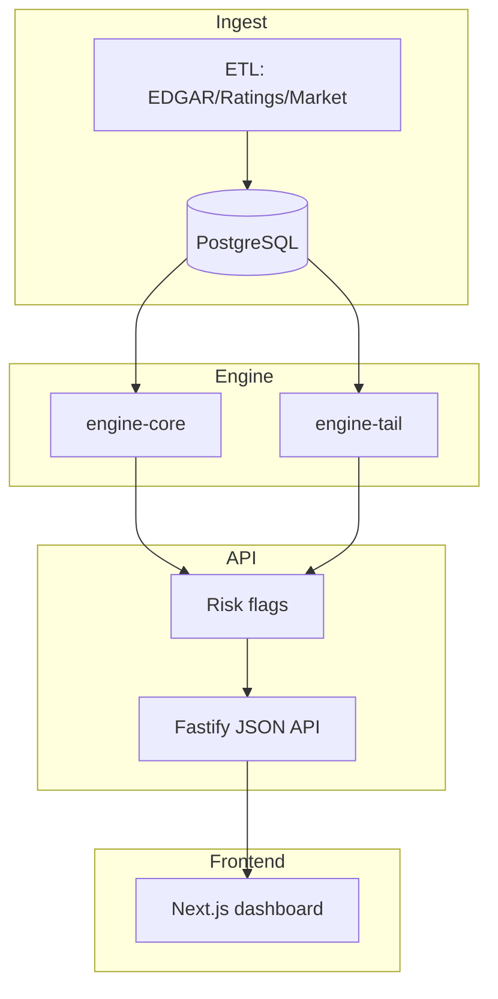

# RiskScan – financial risk scanner

[](https://github.com/lwensveen/risk-scan/actions/workflows/ci.yml)
[](https://codecov.io/gh/lwensveen/risk-scan)
[](https://www.conventionalcommits.org/en/v1.0.0/)
[](LICENSE)


[](https://vitest.dev/)
[](https://turbo.build/repo)
[][swagger-ui]

**RiskScan** is a full‑stack, TypeScript‑first platform that surfaces emerging financial risks.

- **ETL (CLI + schedulable)** → pulls structured data (filings, ratings, market) into Postgres.
- **Risk Engine** → pluggable rule sets (`engine-core`, `engine-tail`) emit human‑readable risk flags.
- **API (Fastify)** → JSON endpoints for flags & replays; Swagger/OpenAPI generated in CI.
- **Web Dashboard (Next.js)** → browse/search flags and drill into issuer snapshots.

---

## Quick start

```bash
# 1) clone & install
git clone https://github.com/lwensveen/risk-scan
cd risk-scan
bun install

# 2) start Postgres & the API
docker compose up -d
cd apps/api && bun dev   # Fastify on http://localhost:4000

# 3) Open API docs (Swagger UI)
#    http://localhost:4000/docs  (when running locally)
#    Or the hosted docs: https://lwensveen.github.io/risk-scan/
```

> **Tip:** Example `.env.example` files exist for each app/package.

---

## Architecture



---

## Monorepo layout

```
apps/
  api/   – Fastify server (docs + JSON API)
  web/   – Next.js dashboard
packages/
  ai/           – going‑concern text detector
  db/           – schema & persistence helpers (Drizzle)
  etl/          – snapshot ingestion & persistence
  engine-core/  – core banking rules
  engine-tail/  – REIT / BDC / Stablecoin / RegionalBank rules
  types/        – shared Zod schemas + enums
  utils/        – cache/slack helpers, config
```

---

## API summary

| Method | Endpoint                    | Description                                                   |
| ------ | --------------------------- | ------------------------------------------------------------- |
| POST   | `/internal/daily-risk-scan` | QStash‑signed webhook → runs ETL + engines                    |
| GET    | `/flags`                    | Filter by `tickers`, `category`, `from`, `to`, `useCreatedAt` |
| GET    | `/flags/latest`             | Latest flags across all tickers                               |
| GET    | `/flags/:ticker`            | All flags for one ticker                                      |
| GET    | `/flags/:ticker/latest`     | Latest flag for one ticker                                    |

- **OpenAPI JSON**: [openapi-json]
- **Swagger UI**: [swagger-ui]

---

## Environment variables

| Name                         | Where              | Notes                                   |
| ---------------------------- | ------------------ | --------------------------------------- |
| `DATABASE_URL`               | API, db, etl       | Postgres connection string              |
| `UPSTASH_REDIS_REST_URL`     | optional (cache)   | Enables HTTP caching/invalidation       |
| `UPSTASH_REDIS_REST_TOKEN`   | optional (cache)   | Upstash REST token                      |
| `QSTASH_CURRENT_SIGNING_KEY` | optional (webhook) | Verify QStash webhook                   |
| `QSTASH_NEXT_SIGNING_KEY`    | optional (webhook) | Verify QStash webhook (rotation)        |
| `SLACK_WEBHOOK`              | optional           | Send summaries to Slack                 |
| `OPENAI_API_KEY`             | optional           | LLM fallback for going‑concern detector |
| `NEXT_PUBLIC_API_URL`        | web                | Base API URL for the dashboard          |

> The API is import‑safe without cache: if Upstash vars are missing, it logs a warning and continues.

---

## Development scripts

```bash
# build everything
bun run build

# lint + type‑check
bun run lint
bun run typecheck

# run tests (with coverage)
bun run test:coverage

# generate OpenAPI locally (writes docs/openapi.json by default)
DISABLE_CACHE=1 bun run api:openapi
```

---

## CI & Docs

- **CI** (GitHub Actions): install → build → tests (coverage) → generate OpenAPI → upload coverage to Codecov.
- **Docs (Pages)**: a Pages workflow builds `docs/` on every push to `main`:
  - Generates `docs/openapi.json` from the server build
  - Converts any `docs/*.md` to static `*.html` (Mermaid supported)
  - Publishes `docs/` to GitHub Pages

**Links**

- **CI**: [ci-workflow]
- **Pages**: [pages-workflow]

---

## Case study

Read the SVB 2023 collapse walkthrough (with diagrams):

- **SVB case (HTML)**: [svb-case]
- **Source markdown**: [`docs/svb-case.md`](docs/svb-case.md)

---

## License

MIT © Lodewijk Wensveen

[openapi-json]: https://lwensveen.github.io/risk-scan/openapi.json
[swagger-ui]: https://lwensveen.github.io/risk-scan/
[ci-workflow]: https://github.com/lwensveen/risk-scan/actions/workflows/ci.yml
[pages-workflow]: https://github.com/lwensveen/risk-scan/actions/workflows/pages.yml
[svb-case]: https://lwensveen.github.io/risk-scan/svb-case.html
