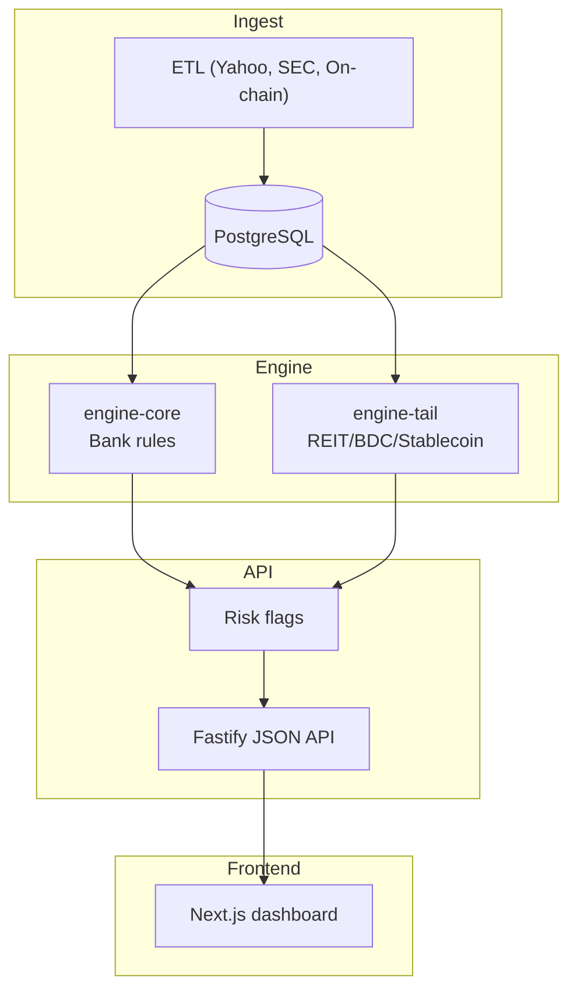

# RiskScan – financial risk scanner

[](https://github.com/lwensveen/risk-scan/actions/workflows/ci.yml)
[](https://codecov.io/gh/lwensveen/risk-scan)
[](https://www.conventionalcommits.org/en/v1.0.0/)
[](LICENSE)


[](https://vitest.dev/)
[](https://turbo.build/repo)
[](https://lwensveen.github.io/risk-scan/)

**RiskScan** is a full‑stack, TypeScript‑first platform that surfaces emerging financial risks.

- **ETL(serverless)** → pulls structured data from Yahoo Finance, SEC API, FRED, on‑chain sources, etc.
- **Risk Engine** → pluggable rule sets (`engine‑core`, `engine‑tail`) create human‑readable risk flags.
- **API (Fastify)** → JSON endpoints for flags & snapshots plus a signed QStash webhook for daily ingest.
- **Web Dashboard (Next 15 / Tailwind)** → interactive charts, ticker filters, CSV/PNG export.

---

## 30‑second quick‑start (demo)

```bash
git clone https://github.com/lwensveen/risk-scan
cd risk-scan
bun install

# run Postgres + API
docker compose up -d

# ingest three sample tickers (≈ 30s)
bun run seed-demo

# fetch the latest flag
curl localhost:4000/flags/NVDA/latest
```

---

## Architecture



---

## Monorepo layout

```
apps/
  api/   – Fastify server (ETL webhook + public JSON API)
  web/   – Next.js 15 dashboard (client‑side charts)
packages/
  etl/          – snapshot ingestion & persistence
  engine-core/  – Core banking risk rules
  engine-tail/  – REIT / BDC / Stablecoin etc. rules
  types/        – shared Zod schemas + enums
  utils/        – QStash/Slack helpers, global config
```

---

## Web dashboard highlights

| Feature              | Path                                | Notes                         |
| -------------------- | ----------------------------------- | ----------------------------- |
| **Flag table**       | `apps/web/app/(dashboard)/flags`    | Severity badges, copy‑to‑CSV  |
| **Ticker compare**   | `apps/web/app/(dashboard)/compare`  | Multi‑series chart (Recharts) |
| **Snapshot details** | `apps/web/app/(dashboard)/[ticker]` | Raw metrics + rule breakdown  |
| Theme                | Radix UI + `next-themes`            | Auto dark/light               |
| Export PNG           | Client‑side `html-to-image`         | Slide‑deck ready              |

---

## 🔌 API summary

| Method | Endpoint                    | Description                                                   |
| ------ | --------------------------- | ------------------------------------------------------------- |
| POST   | `/internal/daily-risk-scan` | QStash‑signed webhook → runs ETL + engines                    |
| GET    | `/flags`                    | Filter by `tickers`, `category`, `from`, `to`, `useCreatedAt` |
| GET    | `/flags/:ticker`            | All flags for one ticker                                      |
| GET    | `/flags/:ticker/latest`     | Latest flag for one ticker                                    |
| GET    | `/snapshot`                 | Filter snapshots by ticker/date                               |
| GET    | `/replay/:ticker/:category` | Re‑run rules on latest snapshot                               |
| POST   | `/replay`                   | Ad‑hoc payload rule evaluation                                |

[OpenAPI JSON spec](https://lwensveen.github.io/risk-scan/openapi.json) — auto‑generated in CI
[SVB collapse demo case](https://lwensveen.github.io/risk-scan/svb-case.html)

---

## Deployment

- **Database**: Neon or Supabase (PostgreSQL >= 15).
- **Backend**(API + ETL): Vercel functions (Edge Runtime), QStash for scheduling.
- **Frontend**: Vercel (Next.js 15). Set `NEXT_PUBLIC_API_URL` to your API URL.

One‑click deploy scripts live in `.github/workflows/`.

---

## Roadmap

- **Pagination & infinite scrolling** for large flag tables
- **Full-text search** across flag descriptions and snapshots
- **ML‑based confidence scoring** to prioritise high‑signal flags
- **ESG & macro rule packs** (green bonds, inflation shocks, etc.)
- **Portfolio view** – aggregate risk by user‑defined ticker baskets or wallet holdings
- **OpenAPI JSON spec** + auto‑generated typed SDK
- **Playground UI** for ad‑hoc `/replay` testing in the browser
- **E2E tests** (Playwright) running in CI
