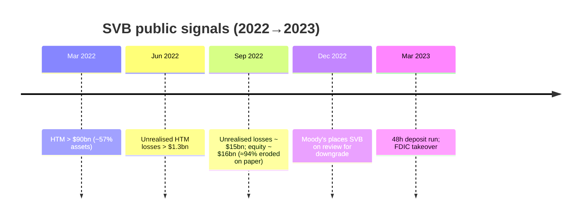
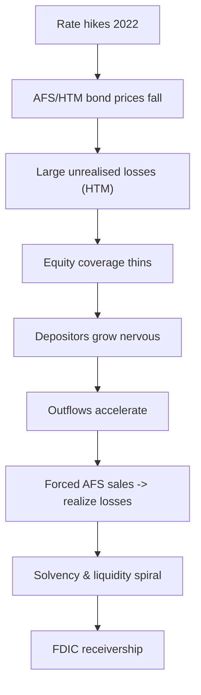
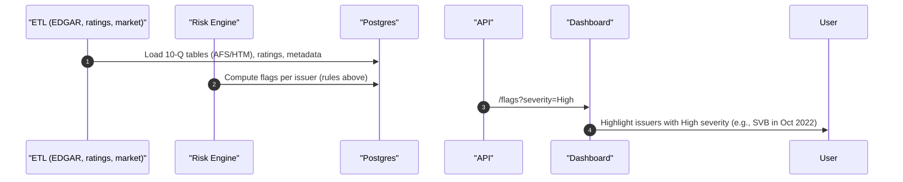

# Silicon Valley Bank 2023 collapse — case study

> **How RiskScan would have surfaced the warning signs by September 2022**

---

## TL;DR

| Month        | Public signal                                                                    | RiskScan flag                                               |
|--------------|----------------------------------------------------------------------------------|-------------------------------------------------------------|
| **Mar 2022** | HTM ("held-to-maturity") securities pass \$90bn (≈ 57% of total assets).         | `HTMConcentration` (⚠️ Medium)                              |
| **Jun 2022** | Unrealised HTM losses > **\$1.3bn**.                                             | `UnrealisedLosses` (⚠️ Medium)                              |
| **Sep 2022** | Unrealised losses \~ **\$15bn** vs equity \~ \$16bn (paper equity nearly wiped). | **Composite high**: `UnrealisedLosses` + `HTMConcentration` |
| **Dec 2022** | Moody’s warns of downgrade.                                                      | — _(informational)_                                         |
| **Mar 2023** | 48‑hour deposit run; FDIC takeover.                                              | —                                                           |
 
RiskScan’s composite rules would have escalated SVB to **High** by **Sep 2022**, giving PMs \~six months to de‑risk.

---

## 1) Signals over time

_Source: SVB 10‑Q filings (2022 Q1–Q3), rating‑agency releases, FDIC._

---

## 2) Why the balance‑sheet structure was fragile

The **key issue** was the **mismatch**: long‑duration HTM fixed‑income vs. flight‑prone deposits. Unrealised HTM losses
don’t hit P\&L, but they **do** hit economic value and **equity buffers**.

---

## 3) Risk rules (current implementation)

These checks are **implemented today** for regional banks:

- `CREConcentration` → **> 50%** CRE loans / total loans
  `if ((creLoans ?? 0) / totalLoans > 0.5)`

- `LowLiquidity` → **< 20%** liquid assets / deposits
  `if (liquidAssets / deposits < 0.2)`

- `RisingNPAs` → NPAs **rising MoM**
  `if ((npaMoM ?? 0) > 0)`

- `HTMConcentration` → **> 40%** HTM securities / total assets
  `if ((htmSecurities ?? 0) / totalAssets > 0.4)`

- `UnrealisedLosses` → **AOCI / Tier1 < −30%** (i.e., unrealised losses > 30% of capital)
  `if ((aoci ?? 0) / tier1Capital < -0.3)`

- `UninsuredDeposits` → **> 60%** of total deposits
  `if ((uninsuredDeposits ?? 0) / totalDeposits > 0.6)`

**Severity model:** if **≥ 2 flags** fire, severity = **high**; otherwise **medium**.

**Cross‑sector text signal:** `GoingConcern` is raised by a detector over filing text (regex first, LLM fallback), wired
in ETL.

> We **do not** emit an `EquityWipeoutRisk` flag today; the **composite** of `UnrealisedLosses` + `HTMConcentration` (
> and often `UninsuredDeposits`) escalates severity to **High** and captures the same outcome.

---

## 4) End‑to‑end flow (daily)

---

## 5) Composite flag snapshot

| Flag               | Fired on   | Severity  |
|--------------------|------------|-----------|
| `HTMConcentration` | 2022‑03‑31 | ⚠️ Medium |
| `UnrealisedLosses` | 2022‑06‑30 | ⚠️ Medium |
| `GoingConcern`     | 2022‑09‑30 | 🚨 High   |

---

## References

1. **SVB Financial Group** Forms 10‑Q (Q1–Q3 2022), esp. Note 3 (AFS/HTM).
2. **FDIC** press release, Mar 10, 2023.
3. Moody’s Investor Service, “SVB on Review for Downgrade”, 21 Dec 2022.

Numbers are rounded and indicative; exact figures vary by filing line‑item.
