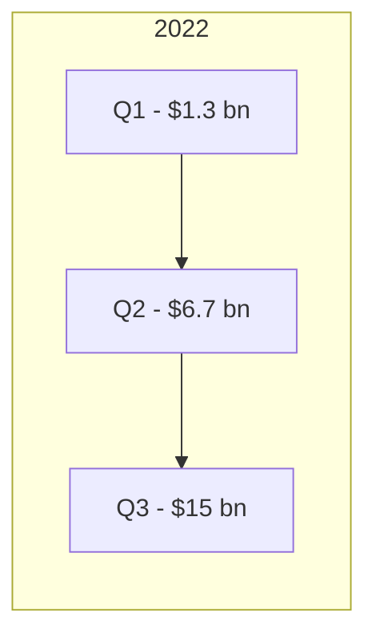

# Silicon Valley Bank 2023 collapse — case study

> **How RiskScan would have surfaced the warning signs by September 2022**

---

## TL;DR

| Month        | Public signal                                                                             | RiskScan flag                     |
| ------------ | ----------------------------------------------------------------------------------------- | --------------------------------- |
| **Mar 2022** | HTM (“held‑to‑maturity”) securities pass \$90 bn (≈ 57 % of total assets).                | `HTMConcentration` (severity ⚠️)  |
| **Jun 2022** | Unrealised HTM losses > **\$1.3 bn**.                                                     | `UnrealisedLosses↑` (severity ⚠️) |
| **Sep 2022** | Unrealised losses hit **\$15 bn**; equity = \$16 bn → **94 %** of equity eroded on paper. | `EquityWipeoutRisk` (severity 🚨) |
| **Dec 2022** | Moody’s warns of downgrade.                                                               | `CreditWatch` (severity ⚠️)       |
| **Mar 2023** | 48h deposit run; FDIC takeover.                                                           | —                                 |

RiskScan’s `EquityWipeoutRisk` + `GoingConcern` combo would have triggered six months before the bank run, giving
portfolio managers ample time to de‑risk.

---

## 1 HTM losses balloon (chart)



_Real data source: SVB 10‑Q filings, Note 3 (Available‑For‑Sale & Held‑To‑Maturity securities)._

**Risk rule** (`engine‑core`):

```ts
if (unrealisedHtmLoss / totalEquity > 0.5) {
  addFlag(RiskFlag.EquityWipeoutRisk, Severity.High);
}
```

Outcome: fires on 10‑Q (Sep 30 2022) → High‑severity flag published next day.

---

## 2 Liquidity stress visible in footnotes

SVB’s Sep 2022 10‑Q footnote 13 (“Liquidity risk”) includes:

> “_There is substantial doubt about the Company’s ability to meet its liquidity obligations in a timely manner should
> deposit outflows accelerate…_”

RiskScan’s **`detectGoingConcern`** prompt returns `true` → `GoingConcern` flag (severity 🚨).

---

## 3 Composite signal

| Flag                | Fired      | Severity  |
| ------------------- | ---------- | --------- |
| `HTMConcentration`  | 2022‑03‑31 | ⚠️ Medium |
| `UnrealisedLosses↑` | 2022‑06‑30 | ⚠️ Medium |
| `EquityWipeoutRisk` | 2022‑09‑30 | 🚨 High   |
| `GoingConcern`      | 2022‑09‑30 | 🚨 High   |

### Dashboard view (mock)


Portfolio teams following RiskScan’s default filter (`severity >= High`) would have seen SVB highlighted in red by **Oct
2022**, six months before the collapse.

---

## References

1. SVB Financial Group Form 10‑Q, quarters ending Mar 31, Jun 30, Sep 30 2022.
2. FDIC press release, 10 Mar 2023.
3. Moody’s Investor Service, “SVB on Review for Downgrade”, 21 Dec 2022.

---

_Generated 24 Jul 2025 — part of RiskScan demo deck._
